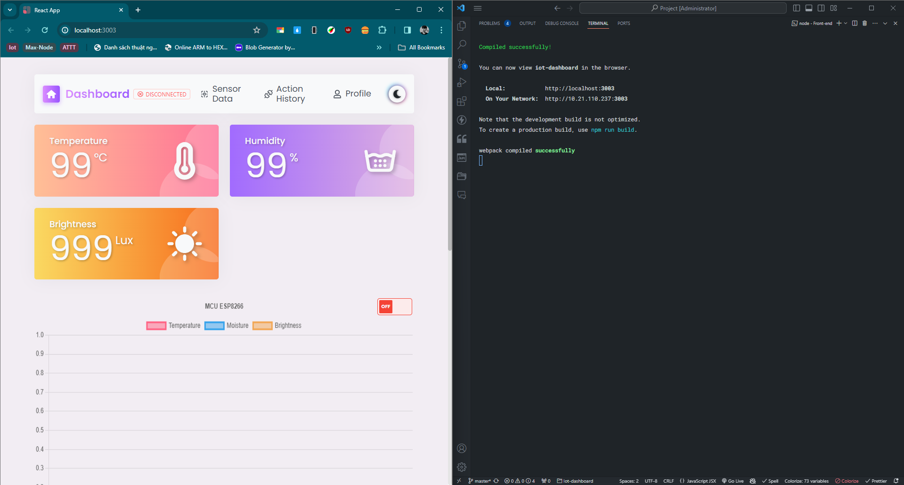
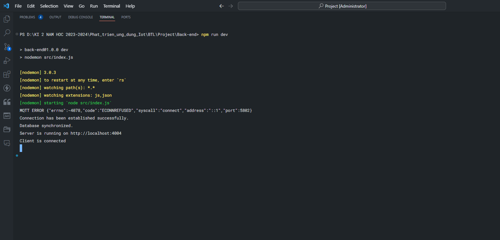

# IoT Dashboard

IoT Dashboard is a web application that allows users to monitor and manage IoT devices through an intuitive and user-friendly interface.


## Technologies Used

### Frontend

- **ReactJS** 🚀: A popular JavaScript library for building user interfaces.
- **Socket.io** 🛰️: A library that enables real-time communication between the client and server.
- **React Router Dom** 🌐: A library for managing routing in React applications.
- **Ant Design** 🎨: A React UI framework developed by Ant Design.

### Backend

- **NodeJS** 🟢: A JavaScript runtime environment for server-side development.
- **ExpressJS** ⚡: A Node.js framework for building web applications and APIs.
- **MQTT** 🌐: A lightweight communication protocol for IoT devices.
- **Socket.IO** 🛰️: A library for real-time bidirectional event-based communication.

### Database

- **MySQL** 🛢️: A powerful and popular relational database management system.

## Installation Guide

### Frontend

1. Navigate to the `Frontend` directory:
   ```bash
   cd Front-end
   ```
2. Install dependencies using npm or yarn:
   ```bash
   npm install
   # or
   yarn install
   ```
3. Start the application:

   ```bash
   npm run dev
   # or
   yarn run dev
   ```

   The application will run at [http://localhost:3003](http://localhost:3003).

   **If the Front-end starts successfully, a browser tab will be opened showing the dashboard ui:**
   

### Backend

1. Navigate to the `Backend` directory:
   ```bash
   cd Back-end
   ```
2. Install dependencies using npm or yarn:
   ```bash
   npm install
   # or
   yarn install
   ```
3. Start the server:
   ```bash
   npm run dev
   # or
   yarn run dev
   ```
   The server will run on port 4004.

**Your terminal when backend start successfully:**


### Hardware

**1. Preparing the hardware**

- [NodeMCU Esp8266](https://shopee.vn/-%C4%90%C3%A3-n%E1%BA%A1p-code-K%C3%ADt-wifi-ESP8266-NodeMCU-Lua-V3-CH340-i.301053603.25618854341?sp_atk=24a19309-fad0-4125-93f8-b106d3511a89&xptdk=24a19309-fad0-4125-93f8-b106d3511a89)
- [DHT11](https://shopee.vn/C%E1%BA%A3m-Bi%E1%BA%BFn-Nhi%E1%BB%87t-%C4%90%E1%BB%99-v%C3%A0-%C4%90%E1%BB%99-%E1%BA%A8m-DHT11-cho-Arduino-Module-DHT11-i.404478549.16887345049?sp_atk=75b939b7-130c-49fd-98f6-7ad7d39c20f1&xptdk=75b939b7-130c-49fd-98f6-7ad7d39c20f1)
- [DHT11](https://shopee.vn/C%E1%BA%A3m-Bi%E1%BA%BFn-Nhi%E1%BB%87t-%C4%90%E1%BB%99-v%C3%A0-%C4%90%E1%BB%99-%E1%BA%A8m-DHT11-cho-Arduino-Module-DHT11-i.404478549.16887345049?sp_atk=75b939b7-130c-49fd-98f6-7ad7d39c20f1&xptdk=75b939b7-130c-49fd-98f6-7ad7d39c20f1)
- [Brightness sensor module](https://shopee.vn/Module-C%E1%BA%A3m-Bi%E1%BA%BFn-%C3%81nh-S%C3%A1ng-c%E1%BA%A3m-bi%E1%BA%BFn-c%E1%BA%A3m-quang-c%E1%BA%A3m-bi%E1%BA%BFn-quang-tr%E1%BB%9F-i.1046874499.20791694471?sp_atk=1bc5c211-b3aa-45fc-8e24-c3ac658f3b20&xptdk=1bc5c211-b3aa-45fc-8e24-c3ac658f3b20)
- Breadboard
- Jumper wires

**2. Connect the components as follows:**
`Connect the pins of DHT11 to the Esp8266 board as follows:`

- VCC pin of DHT11 to the 3.3V pin (VCC) of the Esp8266 board.
- GND pin of DHT11 to the GND pin of the Esp8266 board.
- D4 for OUT pin of DHT11.

`Connect the pins of BRIGHTNESS SENSOR to the Esp8266 board as follows:`

- VCC pin of DHT11 to the 3.3V pin (VCC) of the Esp8266 board.
- GND pin of DHT11 to the GND pin of the Esp8266 board.
- A0 for D0 pin of DHT11. It helps us read the analog data from this sensor.

`LED connection`

- Connect the anode (long leg) of the FAN_LED to pin D2 on the Esp8266, D3 for the LIGHT_LED also.
- Connect the cathode (short leg) of the LED to GND.

**3. Embed code**
Using the ArduinoIDE to push this code into the ESP8266:

```c++
#include <ESP8266WiFi.h>
#include <PubSubClient.h>
#include <DHT.h>
#include <ArduinoJson.h>

// Thông tin WiFi
const char* ssid = "your_wifi_name";
const char* password = "your_wifi_password";
// const char* ssid = "High Kick Mesh";
// const char* password = "68686868";

// Thông tin MQTT broker
const char* mqtt_server = "your_mqtt_address";
const int mqtt_port = 5802; /* Broker port */
const char* mqtt_username = "mqtt_username";
const char* mqtt_password = "mqtt_password";

// Đối tượng cảm biến DHT
#define DHTPIN D4
#define DHTTYPE DHT11
DHT dht(DHTPIN, DHTTYPE);

#define BRIGHTNESS_PIN A0
#define FANPIN D2
#define LIGHTPIN D3

// Đối tượng kết nối WiFi
WiFiClient espClient;
// WiFiClientSecure espClient;
PubSubClient client(espClient);

unsigned long timeUpdate = millis();

void setup_wifi() {
  delay(10);
  Serial.println();
  Serial.print("Connecting to ");
  Serial.println(ssid);
  WiFi.begin(ssid, password);
  while (WiFi.status() != WL_CONNECTED) {
    delay(500);
    Serial.print(".");
  }
  // randomSeed(micros());
  Serial.println("");
  Serial.println("WiFi connected");
  Serial.println("IP address: ");
  Serial.println(WiFi.localIP());
}

void reconnect() {
  while (!client.connected()) {
    Serial.print("Attempting MQTT connection... ");
    String clientID = "ESPClient-";
    clientID += String(random(0xffff), HEX);
    if (client.connect(clientID.c_str(), mqtt_username, mqtt_password)) {
      Serial.println("connected");
      // Subscribe vào topic
      // client.subscribe("esp8266/device/all");
      client.subscribe("esp8266/device/light");
      client.subscribe("esp8266/device/fan");
    } else {
      // Xử lý khi kết nối không thành công
      Serial.print("failed, rc=");
      Serial.print(client.state());
      Serial.println(" try again in 5 seconds");
      delay(5000);
    }
  }
}

void handleDeviceAction(JsonDocument& jsonDoc, int PIN) {
  if (jsonDoc.containsKey("action")) {
    String action = jsonDoc["action"].as<String>();
    action.toLowerCase();
    Serial.println("==> ACTION: " + action);
    digitalWrite(PIN, (action == "on") ? HIGH : LOW);

    // Tạo đối tượng JSON
    DynamicJsonDocument jsonDocStatus(256);

    String topic = "esp8266/device/status";
    if (LIGHTPIN == PIN) {
      jsonDocStatus["light"] = action;
    } else if (FANPIN == PIN) {
      jsonDocStatus["fan"] = action;
    }

    String jsonString;
    serializeJson(jsonDocStatus, jsonString);
    publishMessage(topic.c_str(), jsonString);

  } else {
    Serial.println("No 'action' field in the JSON for " + String(PIN));
  }
}

//-----Call back Method for Receiving MQTT massage---------
void callback(char* topic, byte* payload, unsigned int length) {
  Serial.println("=======================");
  Serial.print("Received message from [" + String(topic) + "]: ");
  String message = "";
  for (int i = 0; i < length; i++) {
    message += char(payload[i]);
  }
  Serial.println(message);

  DynamicJsonDocument jsonDoc(128);
  deserializeJson(jsonDoc, message.c_str());

  if (String(topic) == "esp8266/device/light") {
    handleDeviceAction(jsonDoc, LIGHTPIN);
  } else if (String(topic) == "esp8266/device/fan") {
    handleDeviceAction(jsonDoc, FANPIN);
  }
}

void publishMessage(const char* topic, String payload) {
  if (client.publish(topic, payload.c_str())) {
    Serial.println("Published message from [" + String(topic) + "]: " + payload);
  }
}

void setup() {
  Serial.begin(115200);
  //
  pinMode(LIGHTPIN, OUTPUT);
  pinMode(FANPIN, OUTPUT);
  pinMode(BRIGHTNESS_PIN, INPUT);

  // Kết nối WiFi
  setup_wifi();
  // espClient.setInsecure();

  // Kết nối đến MQTT broker
  client.setServer(mqtt_server, mqtt_port);
  client.setCallback(callback);

  // Khởi tạo cảm biến DHT
  dht.begin();
}

void loop() {
  // Kiểm tra kết nối
  if (!client.connected()) {
    reconnect();
  }
  client.loop();


  if (millis() - timeUpdate > 5000) {
    // Đọc dữ liệu từ cảm biến DHT
    float humidity = dht.readHumidity();
    float temperatureC = dht.readTemperature(false);  // C
    float temperatureF = dht.readTemperature(true);   // F
    int brightness = 1024 - analogRead(BRIGHTNESS_PIN);

    if (isnan(humidity) || isnan(temperatureC)) {
      Serial.println("No data from DHT11!");
    }
    // Tạo đối tượng JSON
    DynamicJsonDocument jsonDoc(256);
    jsonDoc["temperatureC"] = temperatureC;
    jsonDoc["temperatureF"] = temperatureF;
    jsonDoc["humidity"] = humidity;
    jsonDoc["brightness"] = brightness;

    // // Chuyển đối tượng JSON thành chuỗi
    String jsonString;
    serializeJson(jsonDoc, jsonString);

    // Gửi dữ liệu qua MQTT
    String topicDHT11 = "esp8266/sensor";
    publishMessage(topicDHT11.c_str(), jsonString);

    timeUpdate = millis();
    Serial.println("-----------------------------------");
  }
}

```

## Author

- **Hoàng Bá Thanh (ThanK)**
- **Email:** hbthanh5802@gmail.com

## Need Support?

If you encounter any issues during installation or use of the application, please create a new issue in the [Issues](link to issues) section of the project. We will try to assist you as soon as possible.

<a href=https://www.facebook.com/hbthanh5802>  </a>
<a href=https://github.com/hbthanh5802>  </a>
